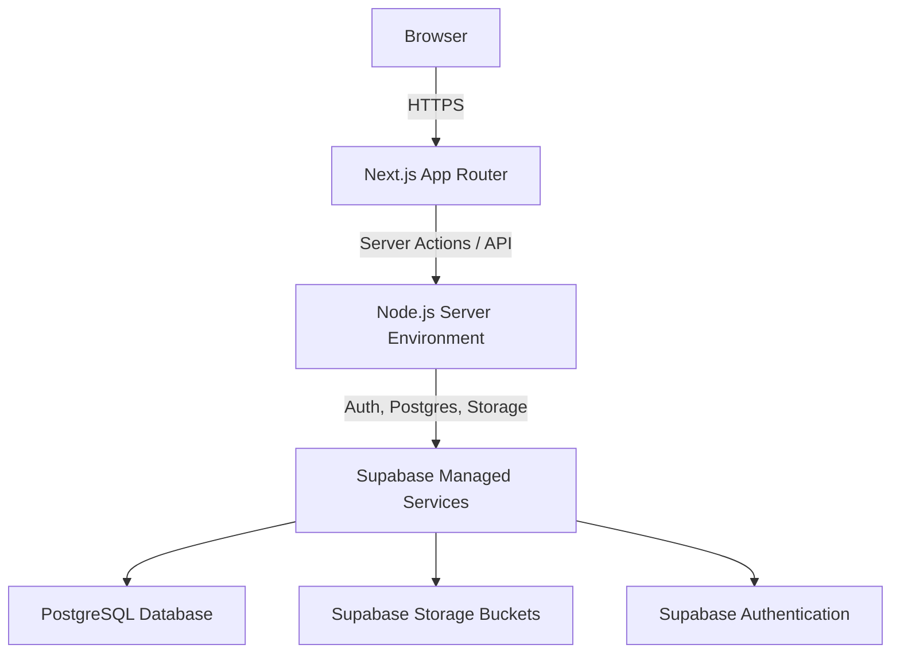

# Architecture

The architecture of DAYVAULT is built using modern web standards for a secure, responsive, and server-rendered application.

## Stack
- **Frontend:** Next.js (App Router), React, Tailwind CSS, shadcn/ui
- **Backend:** Next.js Server Actions & API Routes, Node.js runtime
- **Database & Services:** Supabase (PostgreSQL, Auth, Storage)
- **Deployment:** Vercel-ready

## Architecture Diagram

## Data Flow
1. Client requests pages from the Next.js server.
2. Next.js server statically generates or dynamically renders pages, communicating with Supabase securely.
3. Mutations (creating plans, uploading photos) are handled by Server Actions or Client Uploads directly to Supabase Storage with RLS enforcement.
